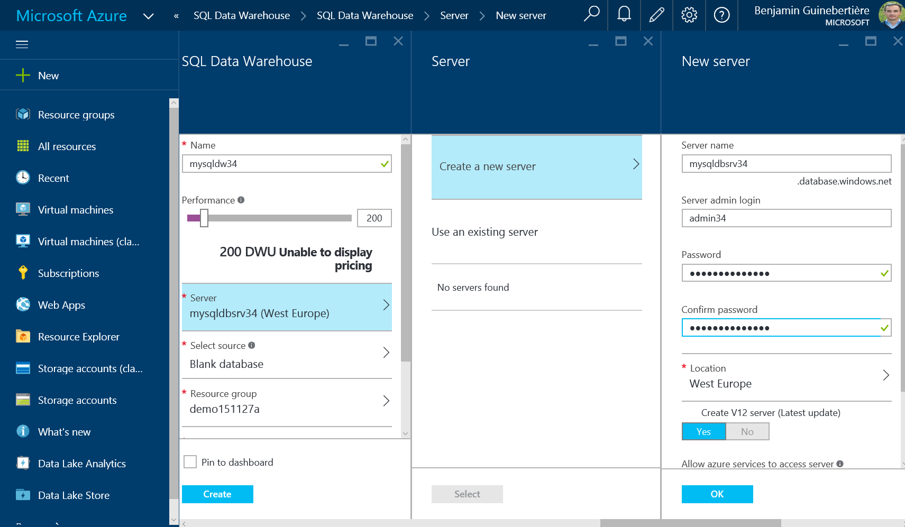
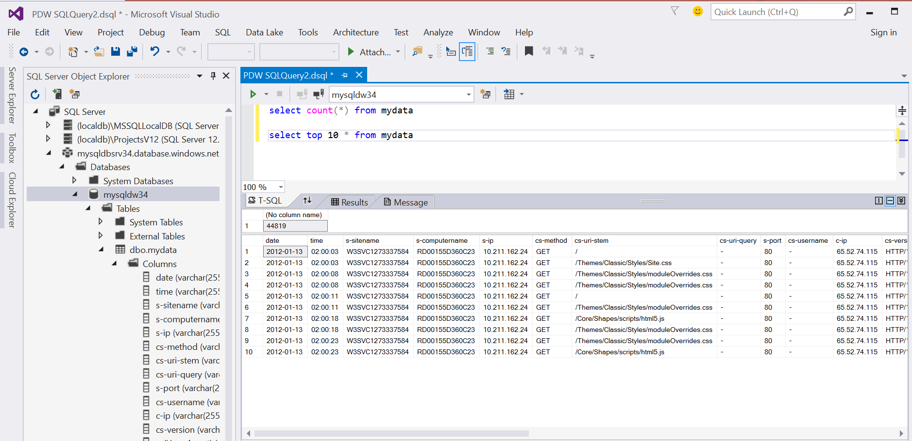
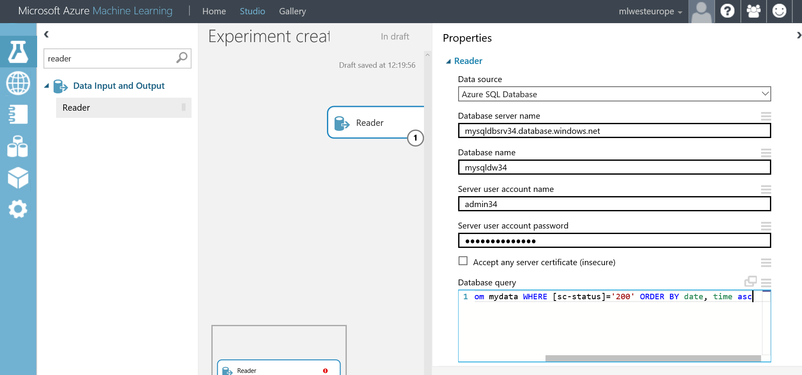
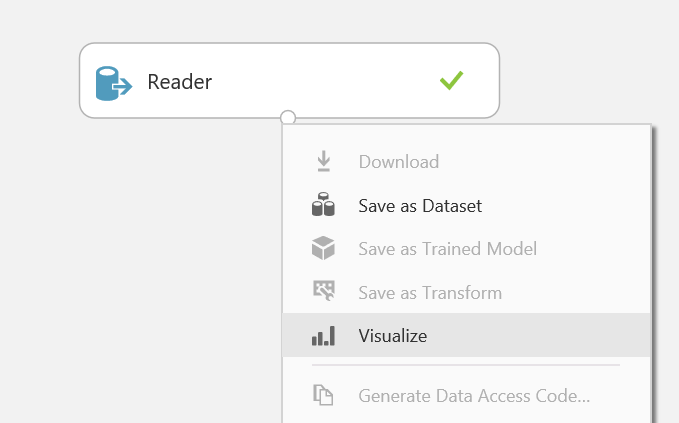
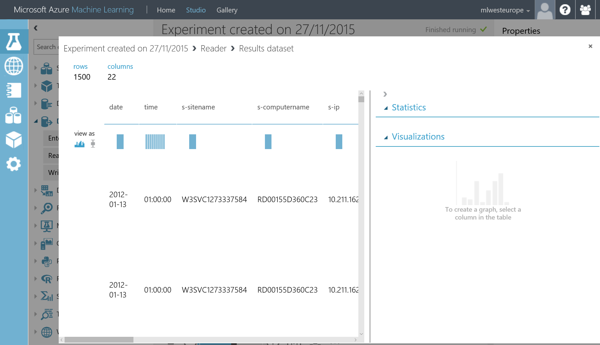
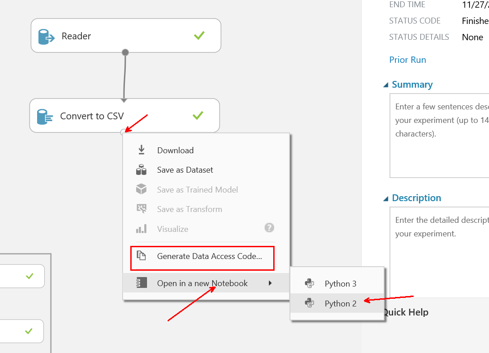
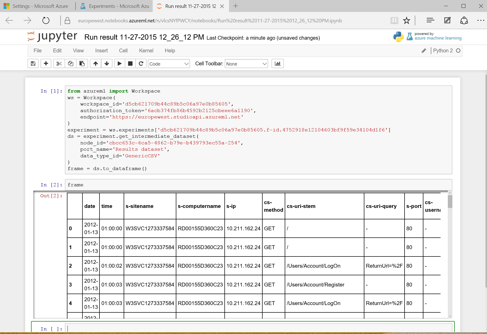
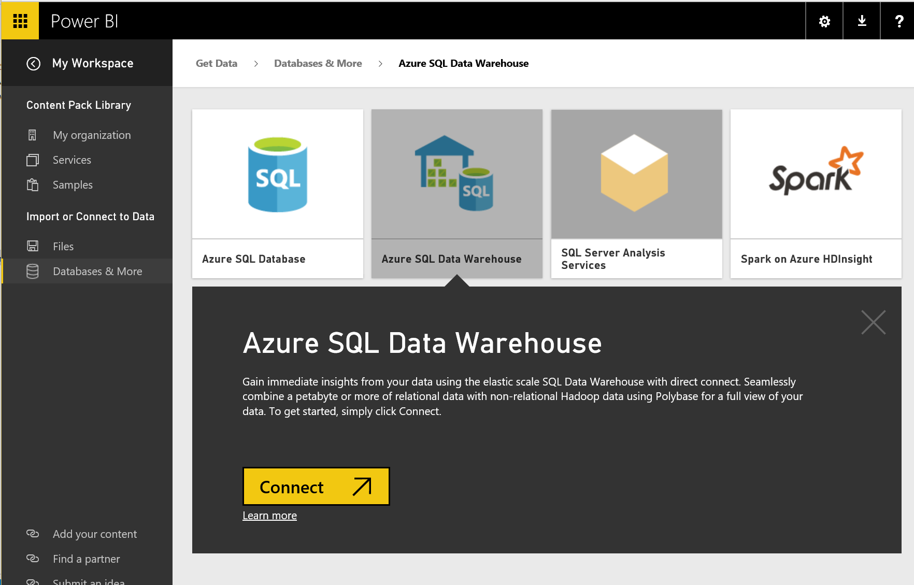

#[Benjamin Guinebertière's blog](http://blog.3-4.fr) (@benjguin)

##SQL DataWarehouse, Azure Machine Learning, Jupyter, Power BI

This blog post shows how to load data from blob storage to the following (in order): 
- SQL Datawarehouse (SQL DW for short). SQL DW has the following advantages
	- It can scale up and down in a few seconds
	- You can load data easily from flat files in Azure Blob with Polybase
	- SQL is a well known language
	- You can do joins
	- You can query it from Azure ML
- Azure Machine Learning
	- learn from the dataset
	- tune your model
	- evaluate scoring and how the model generalize
	- operationalize as a Web API
- a Jupyter notebook
	- explore, plot, transform the dataset in Python
	- document in Markdown
	- ...
- Power BI
	- visualize your data
	- Share the dataviz with others

There is also a good article with demo videos in the following article: [Using Azure Machine Learning with SQL Data Warehouse](https://azure.microsoft.com/en-us/blog/using-azure-machine-learning-with-sql-data-warehouse/).

###conventions

This is a sample. 
By convention, all values ended by 34 should be replaced by your own values. For instance, the data storage account is `mydata34`. Yours should have a different name.

###the sample dataset

The data is available as a number of flat delimited files in a blob storage container. In this example, there are 2 files. here are a few lines of data: 

```
2012-01-13|02:00:00|W3SVC1273337584|RD00155D360C23|10.211.162.24|GET|/Modules/Orchard.Localization/Styles/orchard-localization-base.css|-|80|-|65.52.74.115|HTTP/1.1|Mozilla/4.0+(compatible;+MSIE+8.0;+Windows+NT+5.1)|__RequestVerificationToken_Lw__=JMngbma7rvbnvrzf3Xos7p8GDz3zu4oNwCqOMd0PpxotKkvlvfzHWsGfYm4BJL5CdOCvg7sdtSdOgRGqG9Uick5Jji4cruyaeOv4fYJeN0snqrkYNUI8M179jbaLw80XvLM2OKk8UjxRpKzwjMbBWt6CilU=|http://site.supersimple.fr/|site.supersimple.fr|304|0|0|209|554|15
2012-01-13|02:00:00|W3SVC1273337584|RD00155D360C23|10.211.162.24|GET|/|-|80|-|65.52.74.115|HTTP/1.1|Mozilla/4.0+(compatible;+MSIE+8.0;+Windows+NT+5.1)|__RequestVerificationToken_Lw__=JMngbma7rvbnvrzf3Xos7p8GDz3zu4oNwCqOMd0PpxotKkvlvfzHWsGfYm4BJL5CdOCvg7sdtSdOgRGqG9Uick5Jji4cruyaeOv4fYJeN0snqrkYNUI8M179jbaLw80XvLM2OKk8UjxRpKzwjMbBWt6CilU=|-|site.supersimple.fr|200|0|0|1917|367|203
2012-01-13|02:00:00|W3SVC1273337584|RD00155D360C23|10.211.162.24|GET|/Themes/Classic/Styles/Site.css|-|80|-|65.52.74.115|HTTP/1.1|Mozilla/4.0+(compatible;+MSIE+8.0;+Windows+NT+5.1)|__RequestVerificationToken_Lw__=JMngbma7rvbnvrzf3Xos7p8GDz3zu4oNwCqOMd0PpxotKkvlvfzHWsGfYm4BJL5CdOCvg7sdtSdOgRGqG9Uick5Jji4cruyaeOv4fYJeN0snqrkYNUI8M179jbaLw80XvLM2OKk8UjxRpKzwjMbBWt6CilU=|http://site.supersimple.fr/|site.supersimple.fr|304|0|0|92|520|218
2012-01-13|02:00:00|W3SVC1273337584|RD00155D360C23|10.211.162.24|GET|/Core/Shapes/scripts/html5.js|-|80|-|65.52.74.115|HTTP/1.1|Mozilla/4.0+(compatible;+MSIE+8.0;+Windows+NT+5.1)|__RequestVerificationToken_Lw__=JMngbma7rvbnvrzf3Xos7p8GDz3zu4oNwCqOMd0PpxotKkvlvfzHWsGfYm4BJL5CdOCvg7sdtSdOgRGqG9Uick5Jji4cruyaeOv4fYJeN0snqrkYNUI8M179jbaLw80XvLM2OKk8UjxRpKzwjMbBWt6CilU=|http://site.supersimple.fr/|site.supersimple.fr|304|0|0|209|517|218
2012-01-13|02:00:00|W3SVC1273337584|RD00155D360C23|10.211.162.24|GET|/Core/Shapes/scripts/html5.js|-|80|-|65.52.74.115|HTTP/1.1|Mozilla/4.0+(compatible;+MSIE+8.0;+Windows+NT+5.1)|__RequestVerificationToken_Lw__=2aNXfgccF5TrHacVp9ReeLniHeKovLv/1lYP13EyQ4pYy21MvX4WFH+1Kg9/R+02r4vhkZo0wvOLXZ233O0Sn2QC+n+7EobKV6+7J0lqG0F1g/oc/RCSO3NhrWAoFNzqIEUm0AgJkY0MIhA5XPTX0s0jFLw=|http://site.supersimple.fr/|site.supersimple.fr|304|0|0|209|517|265
2012-01-13|02:00:00|W3SVC1273337584|RD00155D360C23|10.211.162.24|GET|/Core/Shapes/scripts/html5.js|-|80|-|65.52.74.115|HTTP/1.1|Mozilla/4.0+(compatible;+MSIE+8.0;+Windows+NT+5.1)|__RequestVerificationToken_Lw__=JMngbma7rvbnvrzf3Xos7p8GDz3zu4oNwCqOMd0PpxotKkvlvfzHWsGfYm4BJL5CdOCvg7sdtSdOgRGqG9Uick5Jji4cruyaeOv4fYJeN0snqrkYNUI8M179jbaLw80XvLM2OKk8UjxRpKzwjMbBWt6CilU=|http://site.supersimple.fr/|site.supersimple.fr|304|0|0|209|517|218
```

Fields are separated by the pipe character ('|'). The name of the fields are: 

```
date|time|s-sitename|s-computername|s-ip|cs-method|cs-uri-stem|cs-uri-query|s-port|cs-username|c-ip|cs-version|cs(User-Agent)|cs(Cookie)|cs(Referer)|cs-host|sc-status|sc-substatus|sc-win32-status|sc-bytes|cs-bytes|time-taken
```

The data is available in a storage account. 


In this example, the storage account name is `mydata34` and its key is `k2JOuW/nru2nW0y3Icpm9yNTYCrUuNSFm9RDyMuBvIKuYqhtPHAK8MW4bVQfWssXp184pGhlKraaOc7sZTDijQ==`.

The key can be found in the portal, for example:


NB: by the time your read this page, the key may have change. I share the key so that you can find it in code where it is necessary.

###SQL Datawarehouse (SQL DW)

Let's create a SQL DW. 


choose SQL Data Warehouse and click `Create`.

Here is the data you can enter: 
- mysqldw34
- 200 DWU
- Create a new Server
	- mysqldbsrv34
	- admin34
	- DDtgjiuz96____
	- West Europe



Once the SQL DW has been created, we must connect to it. One of the tools you can use is Visual Studio; you can download Visual Studio community edition from [visualstudio.com](https://www.visualstudio.com/). Please refer to [Connect to SQL Data Warehouse with Visual Studio](https://azure.microsoft.com/en-us/documentation/articles/sql-data-warehouse-get-started-connect/) for details.

You must allow your own IP address to access the SQL DB server: 


Let's load the data. 
Here is the code that you can paste in Visual Studio and execute:

```
--also refer to https://azure.microsoft.com/en-us/documentation/articles/sql-data-warehouse-load-with-polybase/


-- Create a master key
CREATE MASTER KEY;

CREATE DATABASE SCOPED CREDENTIAL mydata_secret 
	WITH IDENTITY = 'dummy', 
	Secret = 'k2JOuW/nru2nW0y3Icpm9yNTYCrUuNSFm9RDyMuBvIKuYqhtPHAK8MW4bVQfWssXp184pGhlKraaOc7sZTDijQ==';

SELECT * FROM sys.database_credentials;

CREATE EXTERNAL DATA SOURCE mydata_datasource WITH
(
	TYPE=Hadoop, 
	LOCATION='wasbs://container1@mydata34.blob.core.windows.net', 
	CREDENTIAL=mydata_secret
);

CREATE EXTERNAL FILE FORMAT PIPE_fileformat WITH (
	FORMAT_TYPE = DELIMITEDTEXT,
	FORMAT_OPTIONS (
		FIELD_TERMINATOR='|')
);

drop external table mydata_externaltable;
create external table mydata_externaltable
(
	[date] varchar(255), 
	[time] varchar(255), 
	[s-sitename] varchar(255), 
	[s-computername] varchar(255), 
	[s-ip] varchar(255), 
	[cs-method] varchar(255), 
	[cs-uri-stem] varchar(255), 
	[cs-uri-query] varchar(4000), 
	[s-port] varchar(255), 
	[cs-username] varchar(255), 
	[c-ip] varchar(255), 
	[cs-version] varchar(255), 
	[cs(User-Agent)] varchar(255), 
	[cs(Cookie)] varchar(4000), 
	[cs(Referer)] varchar(255), 
	[cs-host] varchar(255), 
	[sc-status] varchar(255), 
	[sc-substatus] varchar(255), 
	[sc-win32-status] varchar(255), 
	[sc-bytes] varchar(255), 
	[cs-bytes] varchar(255), 
	[time-taken] varchar(255)
)
WITH (
	LOCATION='/flat_files',
	DATA_SOURCE = mydata_datasource,
	FILE_FORMAT = PIPE_fileformat,
	REJECT_TYPE = percentage,
	REJECT_VALUE = 90,
	REJECT_SAMPLE_VALUE = 200
);


-- create table as select: https://azure.microsoft.com/en-us/documentation/articles/sql-data-warehouse-develop-ctas/
CREATE TABLE [dbo].[mydata]
WITH
(
    DISTRIBUTION = ROUND_ROBIN,
    CLUSTERED COLUMNSTORE INDEX
)
AS
	SELECT * FROM mydata_externaltable;

```


the result of the last statement is

```

    (44819 row(s) affected)
    
Query completed. Rows were rejected while reading from external source(s). 
4 rows rejected from external table [mydata_externaltable] in plan step 5 of query execution:
	Location: '/flat_files/weblogs1.txt' Column ordinal: 6, Expected data type: VARCHAR(255) collate SQL_Latin1_General_CP1_CI_AS, Offending value: #Software:|Microsoft|Internet|Information|Services|7.5 (Tokenization failed), Error: Not enough columns in this line.
	Location: '/flat_files/weblogs1.txt' Column ordinal: 2, Expected data type: VARCHAR(255) collate SQL_Latin1_General_CP1_CI_AS, Offending value: #Version:|1.0 (Tokenization failed), Error: Not enough columns in this line.
	Location: '/flat_files/weblogs1.txt' Column ordinal: 3, Expected data type: VARCHAR(255) collate SQL_Latin1_General_CP1_CI_AS, Offending value: #Date:|2012-01-13|01:59:59 (Tokenization failed), Error: Not enough columns in this line.
	Location: '/flat_files/weblogs1.txt' Column ordinal: 21, Expected data type: VARCHAR(255) collate SQL_Latin1_General_CP1_CI_AS, Offending value: |time-taken (Tokenization failed), Error: Too many columns in the line.

```

each file has ~22000 lines so the total numlber of lines seems good.

The rejected lines are some headers that are inside regular rows: 

 

We can now query the data: 

 

###Azure Machine Learning

Let's now get a subset of the data in Azure Machine Learning.
For example, the query we need is 

```
select top 1500 * from mydata WHERE [sc-status]='200' ORDER BY date, time asc
```

Let's assume you have an Azure Machine learning available. You've created a new experiment from the Studio at [studio.azureml.net](https://studio.azureml.net).

Then add a reader

 

In the properties, choose and fill: 
- Azure SQL Database
- mysqldbsrv34.database.windows.net
- mysqldw34
- admin34
- DDtgjiuz96____
- select top 1500 * from mydata WHERE [sc-status]='200' ORDER BY date, time asc

 

click Run at the bottom of the page, then you can visualize the dataset





 
###Jupyter

You may also want to use the dataset in a Jupyter notebook.
For that, you just have to convert the dataset to CSV and then generate the code to access the dataset from Azure Machine Learning.

Drag & drop the Convert to CSV shape, connect it to the reader. Then you can generate the Python code to access that dataset or directly ask for a new notebook that will have access to the dataset: 





###PowerBI

You may also want to see your dataset

For that, you can go to your Power BI environment at [app.powerbi.com](https://app.powerbi.com), choose Get Data, Databases & More and choose Azure SQL Data Warehouse.



- mysqldbsrv34.database.windows.net
- mysqldw34
- Next
- admin34
- DDtgjiuz96____

from there, you have the dataset available, and can visualize it: 


###Conclusion

We saw how to load flat files in a SQL DW, then in Azure Machine Learning and Jupyter, as well as Power BI.

:-) [benjguin](https://twitter.com/benjguin)