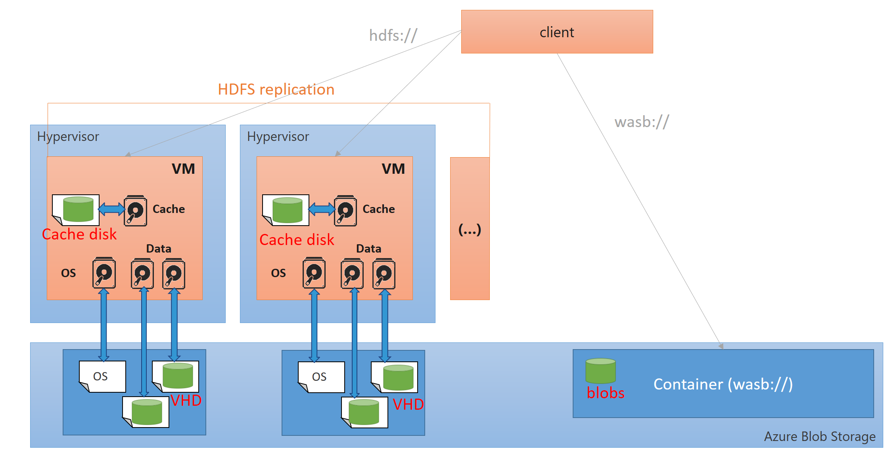
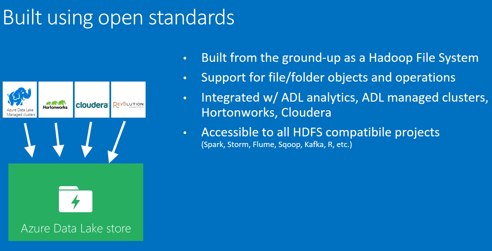

#[Benjamin Guinebertière's blog](http://blog.3-4.fr) (@benjguin)

##different flavors of Hadoop & Spark

There are four main ways to install Hadoop & Spark: 
- from Apache (http://hadoop.apache.org/releases.html) 
- from Cloudera's distribution (http://www.cloudera.com)
- from HortonWorks' distribution (http://hortonworks.com)
- from MapR's distribution (http://mapr.com)

This blog post shows the different options in the context of Azure.

###From Apache (http://hadoop.apache.org/releases.html) 

This option is chosen by people who want to select the components themselves, and want to get the releases as soon as they are available.  

If you want that option, it's probably because your want to have control, rather than using a cluster somebody tailored for you. 
The recommended way to do in Azure is to use Azure Virtual Machines, virtual network, and install everything yourself.
For that, you may want to leverage [Azure Resource Manager templates](https://azure.microsoft.com/en-us/documentation/articles/resource-group-authoring-templates/). A number of examples are available on [GitHub](https://github.com/Azure/azure-quickstart-template). For instance, [this one](https://github.com/Azure/azure-quickstart-templates/tree/master/zookeeper-cluster-ubuntu-vm) deploys a Zookeeper cluster on Ubuntu VMs.

###Hadoop architecture on Azure

There are several ways to deploy a Hadoop cluster on Azure, and several ways to store the data.
A virtual machine on Azure has 
- local disk which is mainly used for cache (Cache disk), 
- Virtual Hard Disks (VHD) that live in the Azure storage; in particular, this is the case of the OS disk (the only exception is with web and worker roles)
- the virtual machine can also access blob storage which is a storage service where one can put files. It is accessible thru REST API, but also thru the wasb (Windows Azure Storage Blob) driver which is available in Hadoop.

Data Lake Store is also a new way of storing big data. For now (NOV 2015) it is in preview and can be used from Data Lake Analytics and HDInsight; later on, it will also be usable from standard distributions:

###comparing Cloudera, Hortonworks and MapR

[Many articles](https://www.bing.com/search?q=hortonworks+and+cloudera+and+mapr) have been written on how the distributions compare.

Here is how I see them.

Hortonworks is the closest to the Apache Hadoop distribution; they release fast, all their code is Apache's code. 
Cloudera is the mots popular; in particular, users like [Impala](http://www.cloudera.com/content/www/en-us/products/apache-hadoop/impala.html) and [Cloudera Manager](http://www.cloudera.com/content/www/en-us/products/cloudera-manager.html).
MapR builds a distribution for business critical production applications; they are well known for their MapR file system (MapR-FS) which can be viewed as HDFS (Hadoop Distributed File System) and NFS (Network File System).

Let now see how you can deploy those distributions on Azure.

###From Cloudera (http://www.cloudera.com)

An automated way of deploying a [Cloudera Enterprise Data Hub cluster has been made available by Cloudera on Azure](https://azure.microsoft.com/en-us/marketplace/partners/cloudera/clouderaedhcloudera/). 

You'll find a [documentation](https://azure.microsoft.com/en-us/blog/full-cloudera-enterprise-edh-support-on-azure/) on how to deploy it on the Azure web site. Also make sure to read the last paragraph (Cloudera Enterprise Deployment from GitHub) which explains there is also a [template on GitHub](https://github.com/Azure/azure-quickstart-templates/tree/master/cloudera-on-centos) if you need more flexibility.

