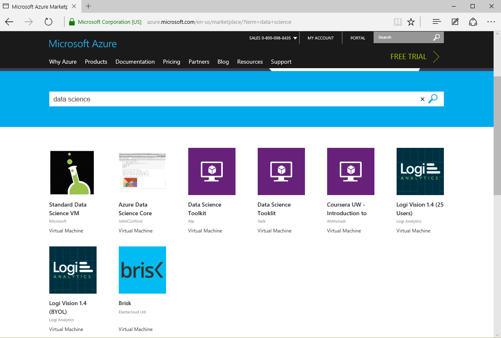
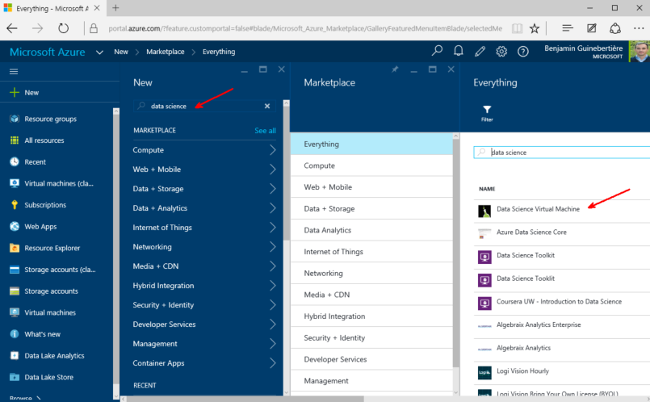
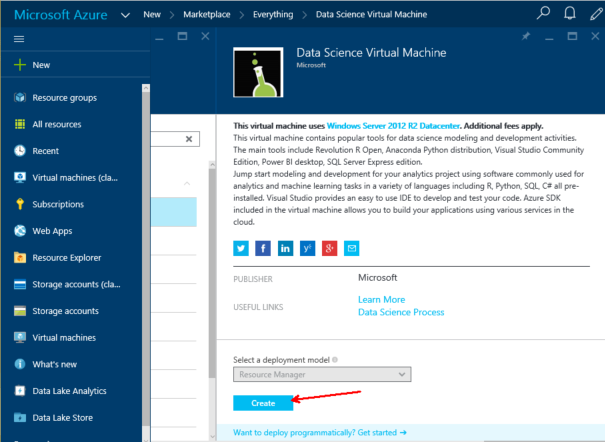
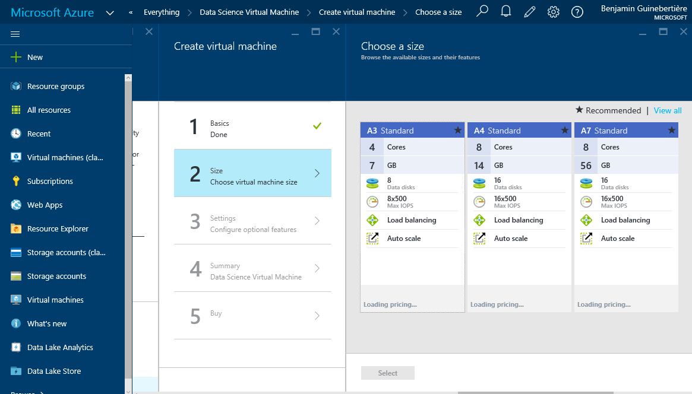
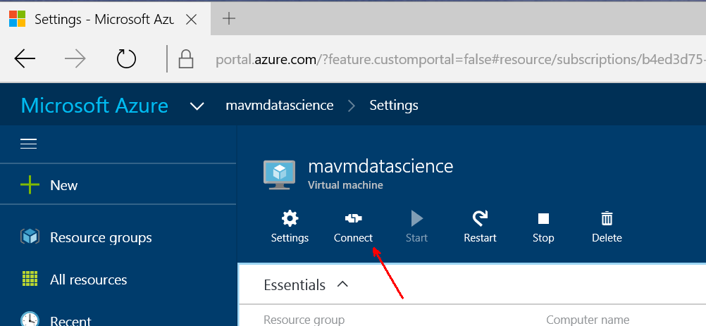
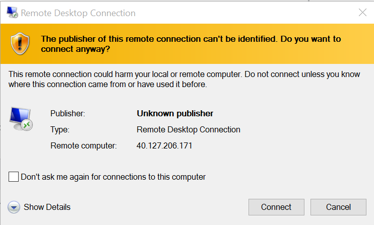

#[Benjamin Guinebertière's blog](http://blog.3-4.fr) (@benjguin)

##Une machine virtuelle dans Azure avec des outils de data science

Microsoft a [mis à disposition récemment](https://social.msdn.microsoft.com/Forums/azure/en-US/home?forum=MachineLearning&announcementId=7edd436b-93e2-4e61-84fb-ba3966d4092d) un modèle de machine virtuelle avec un ensemble d'outils utiles en data science. On peut créer cette machine virtuelle depuis la marketplace Azure. Il existe d'autres VM sur le même thème, comme vous pouvez le voir en allant à [https://azure.microsoft.com/en-us/marketplace/?term=data+science](https://azure.microsoft.com/en-us/marketplace/?term=data+science):

Penchons-nous plus spécifiquement sur la machine virtuelle "Standard Data Science VM" de Microsoft. Elle comprend les outils suivants: 
Revolution R Open, une distribution Anaconda Python incluant Jupyter notebook server, Visual Studio Community Edition, Power BI Desktop, SQL Server Express edition et le SDK Azure.

Pour créer votre propre VM à partir de ce modèle, voici comment procéder. 

Depuis la [page de présentation de la VM](https://azure.microsoft.com/en-us/marketplace/partners/microsoft-ads/standard-data-science-vm/), il vous suffit de cliquer sur le bouton "Create Virtual Machine>", ce qui vous amène dans [la page de création dans le portail](https://portal.azure.com/#create/microsoft-ads.standard-data-science-vmstandard-data-science-vm).

NB: Depuis le portail, on peut aussi chercher cette VM:

On arrive donc sur cette page de description qui permet de créer la machine virtuelle: 

Vous remplissez ensuite les différentes rubriques. 

Voici quelques éléments notables: 
- Basics
	- Vous ne pouvez mettre qu'un mot de passe, pas de clef SSH, car la VM est sous Windows et que Windows ne supporte pas encore SSH. 
	- Location: Si vous travaillez depuis la France, je vous recommande North Europe ou West Europe.
- Size
	- Quelques tailles recommandées sont proposées. Regardez aussi "View All" pour voir s'il n'y a pas des rapports qualité/prix qui vous intéressent plus.  
- Settings: 
	- Storage account. Pour les utilisateurs habituels d'Azure, si vous avez déjà des comptes de stockage, seuls ceux qui apparaissent dans la rubrique "storage account" peuvent être utilisés ici. Ceux dans la rubrique "storage accounts (classic)" ne sont pas utilisables pour héberger le disque VHD de cette VM que vous créez en mode "Resource Manager". Voir par exemple [cette session](https://channel9.msdn.com/Events/Build/2015/3-618) pour plus de détails.
	- vous pouvez garder les options par défaut des autres rubriques de cette section

Quand la machine virtuelle a été créée, vous pouvez vous y connecter en cliquant sur le lien suivant dans le portail:

Cela télécharge un fichier .rdp (rdp=remote desktop protocol) que vous pouvez ouvrir ou conserver pour les prochaines connexions.

Vous pouvez ignorer ce genre de warning

et cliquer sur Connect.

Vous vous connectez avec le compte et le mot de passe que vous avez définis lors de la création de la machine virtuelle.