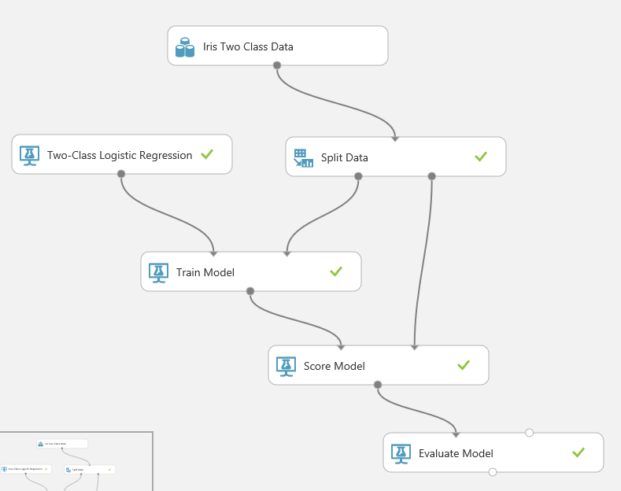

#Azure ML: remove label from web service

Let's take the following simple experiment: 

that you publish as a web service

When you call the web service, you are required to provide the answer to the question you are asking (even if Azure ML won't use it): 

the solution is quite simple: project columns to remove the label from the input: 

and you'll get a better question

:-)
Benjamin (@benjguin)