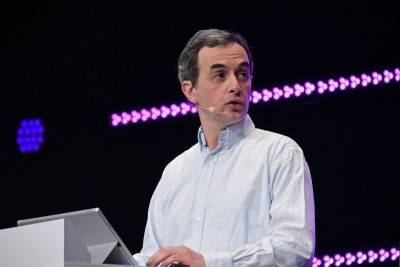

#About Benjamin Guinebertière

Benjamin Guinebertière is a Technical Evangelist @ Microsoft France. He works with startups and companies of different sizes to help them technically adopt Microsoft Azure cloud, should they use Big Data, Machine Learning or other technologies. He also speaks at conferences, writes (blogs, …) and takes feedback.

Benjamin also initiated open source project [boontadata](http://boontadata.io). 

You can reach him at:

- [Twitter (@benjguin)](http://twitter.com/benjguin)
- [LinkedIn](http://fr.linkedin.com/in/benjguin)
- [blog.3-4.fr](http://blog.3-4.fr)
- [blogs.msdn.com/benjguin](http://blogs.msdn.com/benjguin)
- [Facebook](https://www.facebook.com/benjguin)
- [Google+](https://plus.google.com/101963378050065350650)
- [Viadeo](http://www.viadeo.com/fr/profile/benjamin.guinebertiere)
- [Forum des Architecture Applicatives Microsoft (LinkedIn)](http://aka.ms/archimsforum)
- [Channel 9](http://channel9.msdn.com/Niners/benjguin)
- [Youtube](http://www.youtube.com/user/benjguin)
- [slideshare](http://www.slideshare.net/benjguin)
- [Big Data Hebdo (podcast)](http://bigdatahebdo.com)

<a class="twitter-timeline"  href="https://twitter.com/benjguin" data-widget-id="425754375118540800">Tweets by @benjguin</a>

